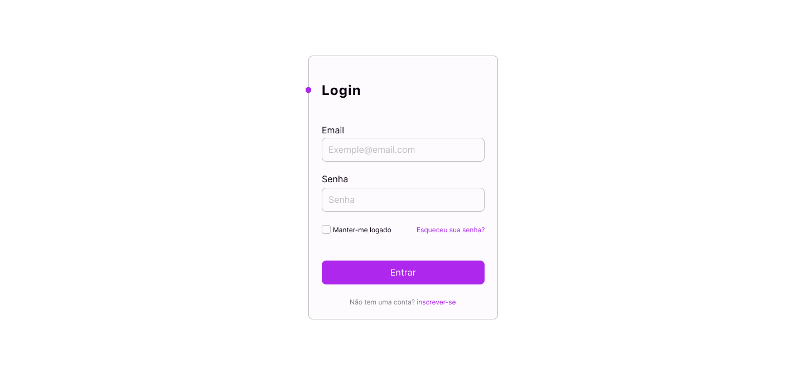

# Projeto de Estudo: Introdução ao HTML e CSS

Este é um documento HTML e CSS simples, criado como parte de um projeto de estudo para aprender os conceitos básicos de HTML e CSS. Ele foi criado para ser apresentado a amigos as tecnologias HTML e CSS, servindo como uma introdução acessível.

## Conteúdo do Documento

- `index.html`: Este é o arquivo principal HTML que contém a estrutura básica de uma página da web. Ele inclui um formulário de login simples com campos para email, senha e opção de "lembrar-me".

- `style.css`: Este é o arquivo de estilo CSS que estiliza o documento HTML. Ele contém regras CSS para posicionar os elementos na página, definir cores, fontes, estilos de botão e outros estilos visuais.

## Conceitos Abordados

Este projeto aborda os seguintes conceitos básicos de HTML e CSS:

1. **Estrutura HTML**: Aprenda sobre as tags HTML essenciais, como `<html>`, `<head>`, `<body>`, `<section>`, `<form>`, `
`, `<label>`, `<input>`, `<button>`, etc.

2. **Estilização CSS**: Explore propriedades CSS comuns, como `background`, `border-radius`, `padding`, `margin`, `font-family`, `font-size`, `color`, `display`, `align-items`, `flex-direction`, `justify-content`, etc.

3. **Seletores CSS**: Saiba como segmentar elementos específicos em seu documento HTML para estilizá-los usando seletores CSS, como classes, IDs e elementos.

4. **Comentários**: Compreenda a importância de adicionar comentários ao código para explicar o que cada parte do código faz. Isso pode ajudar na compreensão do código e no aprendizado dos conceitos.

## Como Usar

Para visualizar este projeto, basta abrir o arquivo `index.html` em seu navegador da web. Você também pode modificar os arquivos HTML e CSS para experimentar com diferentes estilos e layouts.
